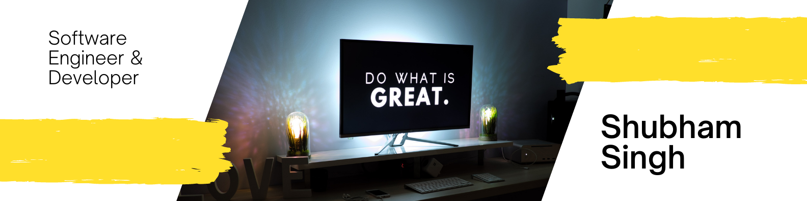

<h1 align="center">Hi 👋, I'm Shubham</h1>
<h3 align="center">A Competitive Coder, Full Stack Developer, Investor & Entrepreneur</h3>

  

<h3 align="left">More About Me</h3>

Hello! I am an undergrad student at NIT where I am pursing B.Tech in CSE. I have a deep passion for learning new technologies and combining them into creative work.

<h3 align="left">My Tech Stack</h3>
<ul>
  <li>C/C++</li>
  <li>Javascript and JQuery</li>
  <li>Node.js with Express.js</li>
  <li>ReactJS</li>
  <li>MongoDB</li>
  <li>Mongoose</li>
  <li>Linux</li>
  <li>Kotlin</li>
</ul>

<h3 align="left">My Projects</h3>
<ul>
  <li>Biryani Bowl</li>
  <li>Barber Mess</li>
  <li>Douple</li>
  <li>System Hiring</li>
</ul>

<h3 align="left">Extra Curricular</h3>
<ul>
  <li>Cricket and Football</li>
  <li>Reading Self Help Books</li>
  <li>Writing Blogs</li>
</ul>

<h3 align="left">Connect With Me</h3>

  

<h3 align="left">Quote</h3>
_" Any fool can write code that a computer can understand. Good programmers write codes that humans can understand "_  - Martin Fowler

